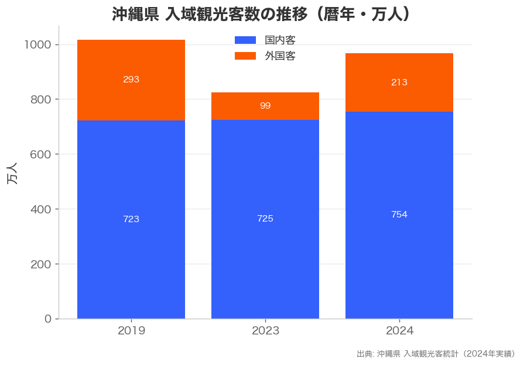
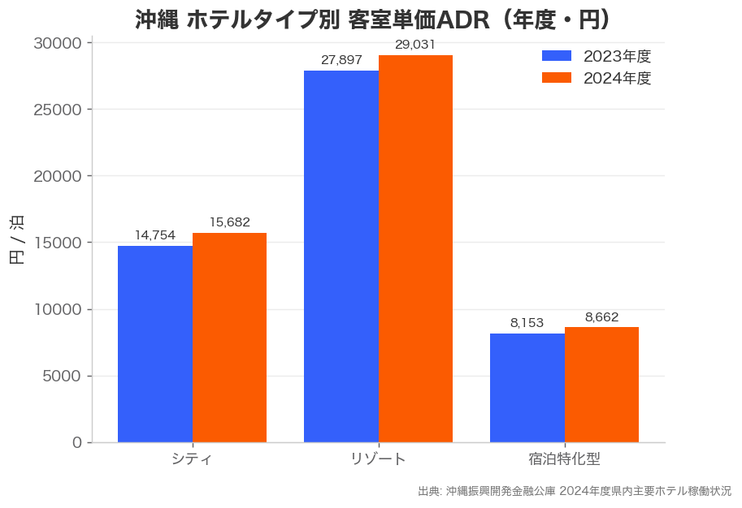
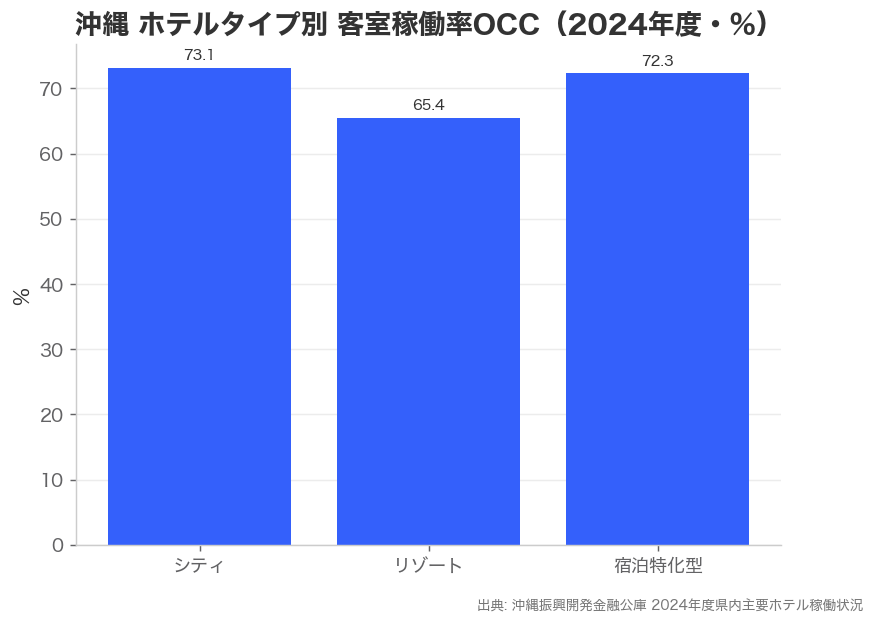
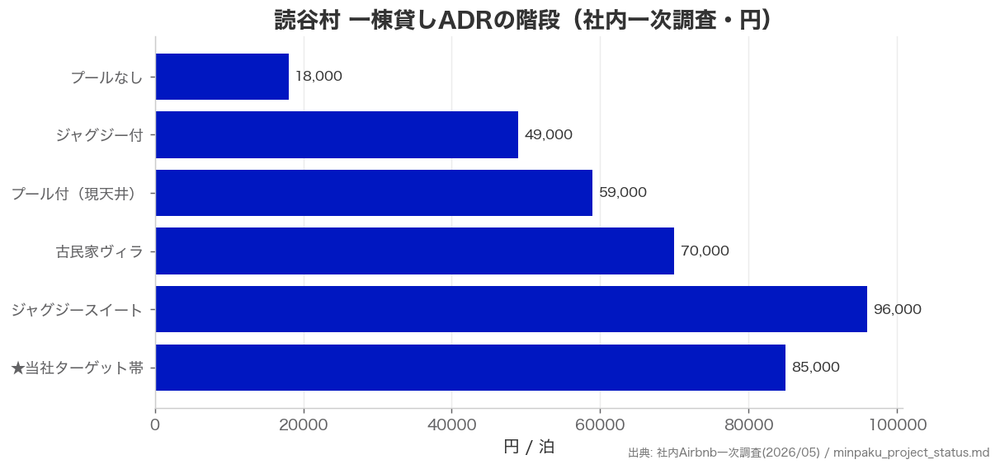
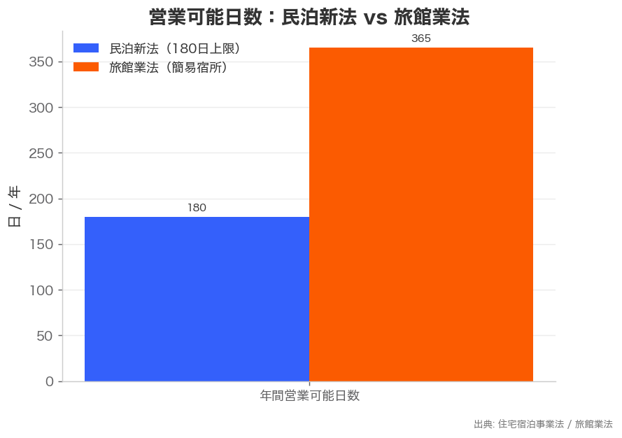
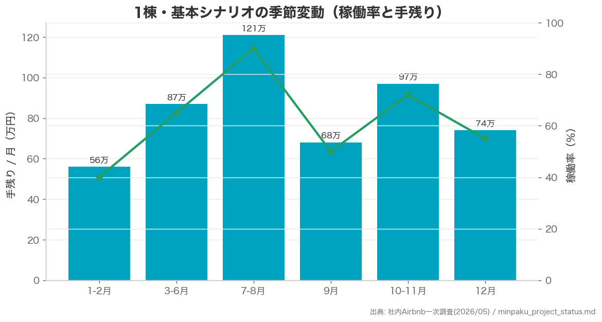
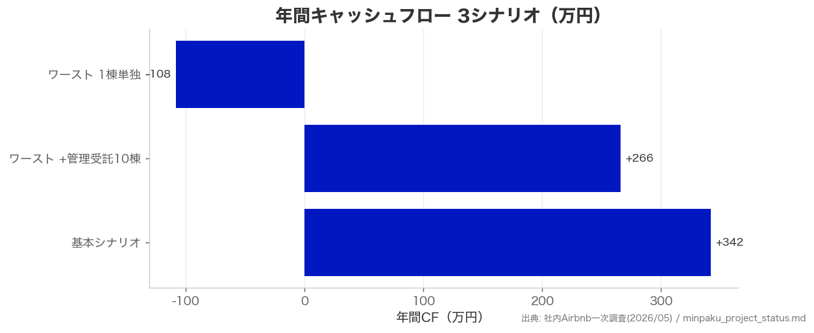

# 沖縄 不動産×宿泊事業 リサーチ＆提案レポート

- 作成日: 2026年5月29日
- 作成: COO（戦略・経理・沖縄民泊リサーチ・クリエイティブ／可視化）
- 目的: 沖縄の観光・宿泊市場を数字で確認し、「不動産事業を始めるならどの形が良いか」を提案する
- 図版: `docs/creative-visual/okinawa/`（matplotlib でデータから生成。画像生成AIは未使用）

---

## 【COO】結論

**結論: 旅館業法（簡易宿所）ベースのラグジュアリー一棟貸し（読谷村）を「保有運営 → 管理受託 → 運営OS」の3層モデルで始めるのが最有力。**

理由は3つ、いずれも数字の裏付けがある。

1. **需要は回復・拡大基調**。沖縄の入域観光客は2024年（暦年）966万人で2019年比95%まで回復、国内客は過去最高。外国客は前年の2倍超（98万→213万人）で、伸びしろが大きい。県は2025年度に再び1,000万人超を見込む。
2. **単価が上がっている**。リゾートホテルのADRは2024年度29,031円（4年連続上昇・2019年度超え）。価格転嫁が効く市場で、高単価帯ほど取りやすい。
3. **読谷村の高単価帯は空白**。社内一次調査でプール付の現天井がADR59,000円。プール＋サウナ＋バイリンガルコンシェルジュを揃えた70,000〜100,000円帯は競合ゼロ＝先行者優位。

リスク（稼働率下振れ・台風・金利上昇）は、①旅館業法での通年稼働、②管理受託10棟による固定収入、③RC造＋固定金利、で吸収できる設計。

---

## エグゼクティブサマリー（数字）

| 指標 | 値 | 出典 |
|---|---|---|
| 沖縄入域観光客（2024暦年） | 966.2万人（前年比+17.3%、2019年比95%） | 沖縄県入域観光客統計 |
| うち外国客（2024） | 212.6万人（前年98万人の約2.2倍） | 同上 |
| 国内客（2024） | 753.6万人（過去最高） | 同上 |
| リゾートホテルADR（2024年度） | 29,031円（前年度+4.1%） | 沖縄振興開発金融公庫 |
| リゾートホテルOCC（2024年度） | 65.4%（前年度+3.1pt） | 同上 |
| 読谷村 一棟貸しADRの現天井 | 約59,000円（プール付） | 社内Airbnb一次調査(2026/05) |
| 当社ターゲットADR帯 | 70,000〜100,000円（競合空白） | 同上 |

---

## 1. 市場環境：需要は回復し、インバウンドに伸びしろ

入域観光客は2024年で2019年比95%まで戻り、**国内客は過去最高**。注目は外国客で、2023年98万人 → 2024年213万人と2倍超に急回復したが、2019年比ではまだ7割程度＝**今後の伸びしろが大きい**。高単価宿泊の主要顧客であるインバウンド富裕層の戻りは、ラグジュアリー一棟貸しに直接効く。

---

## 2. 宿泊市場：単価が上がり続け、価格転嫁が効く

ホテルの客室単価（ADR）は全タイプで4年連続上昇し、2024年度は2019年度を上回った。特に**リゾートは29,031円**。稼働率（OCC）もリゾート65.4%まで回復。物価・人件費上昇を価格に乗せられている市場で、**高単価セグメントほど取りやすい**ことを示す。

なお、2025年開業のテーマパーク「ジャングリア沖縄」により沖縄北部（読谷村を含む6市町村圏）のADRが底上げされ、夏ピーク強化に続いて2026年初夏以降は通年化の兆しも観測されている（HotelBank 集計）。読谷村は北部商圏の周遊拠点として追い風。

---

## 3. 立地：読谷村の高単価帯は「空白地帯」

社内のAirbnb一次調査（2026年5月）では、読谷村の一棟貸しADRは下図の「階段」を形成。**プール付の現天井が約59,000円**で、プール＋サウナ＋専属バイリンガルコンシェルジュを同時に備えた**70,000〜100,000円帯は競合ゼロ**。世界遺産・座喜味城跡や残波岬など観光資産が車5〜10分圏に集積し、嘉手納基地等の米軍需要が冬季稼働を下支えする。

---

## 4. 規制：旅館業法で「通年稼働」を取りに行く

民泊新法（住宅宿泊事業法）は年間180日上限で、機会損失が約49%。**旅館業法（簡易宿所）なら365日フル稼働**でき、通年ローン返済をカバーできる。OTA上位表示・インバウンド対応でも有利。読谷村は民泊新法の制限区域（学校100m規制）があるため、旅館業法取得でこれを回避するのが定石。

取得コスト目安（1棟・読谷村）: 防火設備100〜300万円、建基法適合工事100〜300万円、申請2〜5万円、期間2〜4ヶ月。**購入前に行政書士・消防への事前相談を必須化**する。

---

## 5. 提案する事業モデル（不動産→プラットフォーム）

| Layer | 時期 | 内容 | 目標 |
|---|---|---|---|
| **L1 自社運営** | 2026〜 | 読谷村に旅館業法取得済みヴィラを保有・運営（実証・ブランド） | 3棟・年商5,000万円 |
| **L2 管理受託** | 2027〜 | 他者物件の管理代行（手数料 売上の20〜25%、約200万円/棟/年） | 10棟で固定収入確立 |
| **L3 運営OS（SaaS）** | 2028〜 | 価格最適化・ゲスト/チャネル管理を製品化 | MRR 3,000万円 |

ポイントは、**不動産（保有資産×稼働の上限）に縛られず、管理受託とSaaSでスケールに転換する**こと。L2の管理受託が「自社稼働率に依存しない固定収入」になり、下振れ耐性を作る。

---

## 6. 財務：季節変動とシナリオ

基本シナリオ（ADR 70,000〜90,000円・稼働率65%）で年間営業利益 約1,067万円。月次は夏ピークが厚く、閑散期（1〜2月・9月）も米軍需要で底が堅い。

シナリオ別の年間キャッシュフロー（1棟ベース）。**1棟単独のワーストケースは赤字（▲108万円）だが、管理受託10棟を組み合わせると+266万円で黒字転換**する。これがこのモデルの肝。

資金調達: 事業融資3,200〜5,000万円（沖縄振興開発金融公庫の観光振興優遇＋日本政策金融公庫）、20年・固定金利2.0〜2.5%希望。2025年12月の日銀利上げ後リスクを踏まえ**固定金利を基本方針**。

---

## 7. 主要リスクと対策

| リスク | 対策 |
|---|---|
| 稼働率下振れ（ADR50,000・OCC50%） | 管理受託10棟で固定収入→黒字維持 |
| 台風（年3〜5回） | RC造を優先、台風保険 |
| 金利上昇 | 固定金利での借入 |
| 規制強化 | 旅館業法取得で民泊新法の影響を遮断 |
| 旅館業取得失敗 | 購入前に行政書士・消防の事前確認を必須化 |
| 供給増・人手不足 | 高単価ニッチ（70,000〜100,000円帯）に集中、運営OSで省人化 |

---

## 8. 次アクション

1. 読谷村の旅館業取得可能物件を2〜3件ピックアップ → 現地内覧
2. 行政書士へ旅館業法取得可否の事前相談、消防へ防火要件確認
3. 沖縄振興開発金融公庫・日本政策金融公庫へ打診・面談予約
4. プール／サウナ設置業者へ見積（読谷村対応）
5. 競合物件に実宿泊（サービス品質・価格の検証）

---

## 出典

- 沖縄県文化観光スポーツ部「入域観光客統計概況」（2024年実績、2025年1月発表）
- 沖縄振興開発金融公庫「2024年度県内主要ホテルの稼働状況」（2025年9月発表）
- HotelBank「ジャングリア沖縄／北部リゾート市場分析」（2026年）
- 社内 Airbnb 一次調査（2026年5月、読谷村）および `company/memory/minpaku_project_status.md`

> 注: 法務・税務・融資条件は確定情報ではない。旅館業取得可否、防火・建基法要件、融資金利・条件は、行政書士・建築士・消防・金融機関・税理士による確認が必要。
