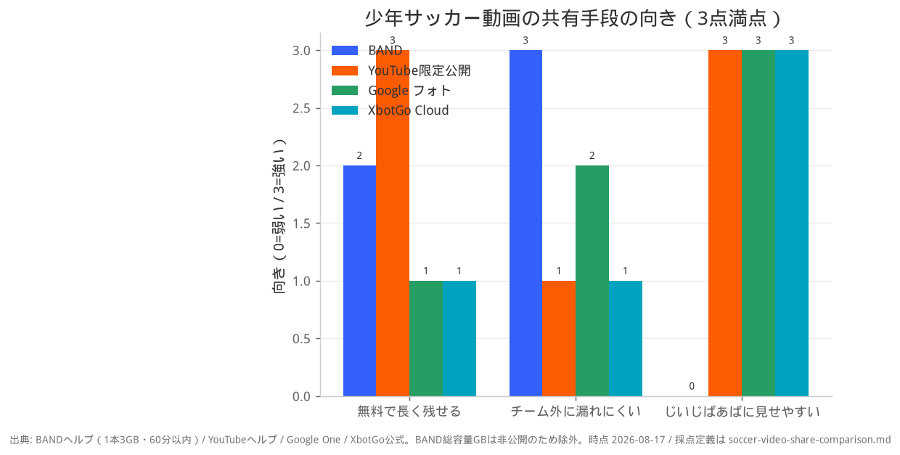
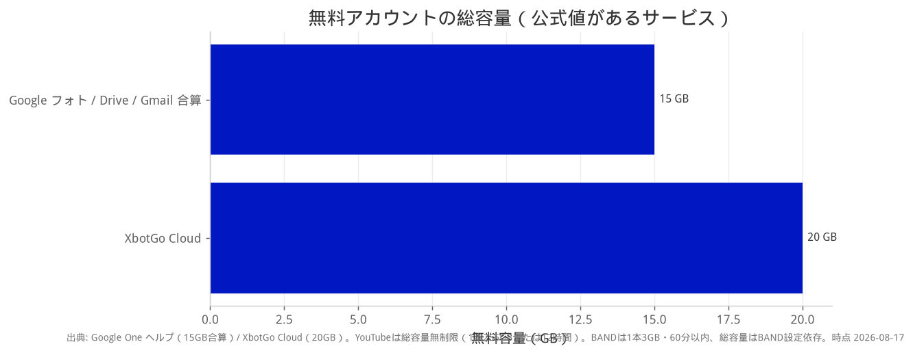

# 少年サッカー動画の共有比較（BAND追加版）

- 作成: 2026-08-17
- 前提: XbotGo で撮った子供の試合動画を、保護者グループへ共有する
- 追記: 倉谷さんコメント（去年の6年生は BAND 運用。他チーム研究対策）

## グラフ





## 採点定義（向きグラフ・3点満点）

| 観点 | 3 | 2 | 1 | 0 |
|------|---|---|---|---|
| 無料で長く残せる | 総容量が実質無制限 | 1本は十分だが全体容量の掃除が必要 | 十数GBでシーズン途中に不足しやすい | — |
| チーム外に漏れにくい | メンバー以外は原則見られない | 共有アルバム等、招待範囲は絞れるが転送は可能 | URL転送で第三者視聴が容易 | — |
| じいじばあばに見せやすい | リンク転送やアルバム共有で見せられる | — | Googleアカウント招待などが必要 | グループ未参加だと見られない |

## サービス比較（事実）

| | BAND | YouTube | Google フォト | XbotGo Cloud |
|--|------|---------|---------------|--------------|
| 無料の1本上限 | **3GB かつ 60分以内** | 256GB または 12時間（要アカウント確認） | 総量内なら制限なし | 総量内なら制限なし |
| 無料の総容量 | BANDごとにあり。**3分超は容量を消費**。満杯だと古い順に消える場合あり | **実質無制限** | **15GB**（Gmail・Driveと合算） | **20GB** |
| 誰が見られる | **BANDメンバーのみ**。リンク転送不可 | 非公開=招待のみ / 限定公開=URLを知っている人 | 共有アルバムの相手 | 共有リンク（ログイン不要の場合あり） |
| 月額 | 基本無料。追加ストレージは有料 | 無料 | 100GB は Google One 有料 | クラウド20GBは月額なし |

## 倉谷さんコメントの要点

- 去年の6年生は BAND で管理
- 1本 3GB・60分以内なら無料アップ可能
- 残したい動画がある場合、不要ファイル削除の手間がある
- メンバー以外は見られないので、他チーム研究対策になる
- じいじばあばへリンク転送できないのは、今段階では不便にもなり得る

## 方針（2026-08-17 返信後）

坂倉さんからグループへ返信済み。要点:

- 週末の3連戦で各サービスを試す
- 今の3年生は他チーム研究のリスクは小さそう
- 一方、ママ側は外部流出を若干心配している
- Drive も BAND も **容量管理・削除が手間** という印象

### 3連戦の試し分け案

Drive は既に「削除が面倒」と分かっているので、本試験では外す。

| 試合 | 共有先 | 見るポイント |
|------|--------|----------------|
| 1試合目 | **YouTube 限定公開** | 削除なしで残るか、家族にリンクを渡せるか |
| 2試合目 | **BAND** | ママの流出心配が和らぐか、参加の手間 |
| 3試合目 | **XbotGo Cloud リンク** | 撮った直後の仮置きとして一番ラクか |

週末後に残す本命は、削除が要らない **YouTube 限定公開** が有力。BAND は「漏れにくさ」の保険として残すかどうかを判断する。

---

## LINE下書き① 倉谷さんへの返信

```
倉谷さん、情報ありがとうございます🙏
去年の6年がBAND運用だった件、とても参考になりました。

比較にBANDを足すと、こう整理できそうです。

■ BANDの強み
・メンバー以外は見られない（リンク転送不可）
・1本 3GB / 60分以内なら無料アップ可
・去年の6年が、他チーム研究対策で選んだ実績あり

■ BANDの注意
・全体容量があるので、残す動画は掃除が必要
・じいじばあばへのリンク転送はできない

■ 他との違い（容量）
・YouTube：総容量は実質無制限
・Googleフォト：15GB（Gmail等と合算）
・XbotGo：20GB（撮った直後の仮置き向き）

今の学年は「外部に漏れる心配はまだ小さい」とのことなので、
・家族にも見せたい → YouTube（限定公開）
・チーム内だけで完結 → BAND
の2択が分かりやすいかな、と思っています。

あくまで整理です。皆さんの使いやすさ優先で決められれば！
重ねてありがとうございます🙏
```

## LINE下書き② グループ共有用（BAND入り・更新版）

```
【試合動画の共有 比較・更新】
倉谷さんからBANDの実績共有がありました🙏
去年の6年生はBAND運用だったそうです。

━━━━━━━━━━━━
■ 候補
━━━━━━━━━━━━
① BAND … メンバー以外は見られない。1本3GB/60分まで無料
② YouTube（限定公開） … 容量ほぼ無限。リンクで家族にも見せやすい
③ Googleフォト … 見やすいが無料15GB
④ XbotGo Cloud … 撮った直後の仮置き（20GB）
⑤ LINE直接 … ハイライトのみ（フル試合は画質落ち）

━━━━━━━━━━━━
■ 向き不向き
━━━━━━━━━━━━
チーム外に漏れにくさ
BAND ◎ ／ YouTube限定公開 △（リンク転送で漏れる）

じいじばあばに見せやすさ
YouTube・Googleフォト・XbotGo ◎ ／ BAND ×（未参加だと見れない）

無料で長く残せる
YouTube ◎ ／ BAND ○（掃除が必要） ／ フォト・XbotGo △

━━━━━━━━━━━━
■ 去年6年がBANDにした理由
━━━━━━━━━━━━
他チームにプレイを研究され始めたため、
「グループに入っている人だけが見れる」運用にした、とのこと。

今段階ではそこまで気にしなくてよい、
という見方もあります（倉谷さんコメント）。

━━━━━━━━━━━━
■ お願い
━━━━━━━━━━━━
・ダウンロード・SNS再投稿はご遠慮ください
・リンクの外部共有もお控えください

ご意見あれば教えてください🙏
```

## LINE下書き③ 短縮版

```
【動画共有・更新】倉谷さん情報反映

BAND … メンバー限定で安全。1本3GB/60分まで無料。去年の6年が採用（他チーム研究対策）。じいじばあばへ転送は不可
YouTube限定公開 … 容量∞。家族にリンクしやすい。転送で漏れる点は注意
Googleフォト … 15GB
XbotGo … 20GB・仮置き向き

今は
家族にも見せたい→YouTube
チーム内完結→BAND
の2択が分かりやすそうです。

ご意見ください🙏
```

## LINE下書き④ 3連戦の試し分け（任意・送らなくても可）

```
週末の3連戦、試し分け案です！

1試合目 YouTube（限定公開）… 容量管理なし
2試合目 BAND … メンバー以外は見れない
3試合目 XbotGoのリンク … 撮った直後の仮置き

Driveは容量の掃除が面倒なので今回は見送りで。
週末終わったら、どれがラクだったか教えてください🙏
```
